Need a solution for creating a quick telegram notification bot and don't want to have to host one? I found it, and maybe more than just a bot.

The issue originally came up because our FYP team decided to do bi-weekly standups using Telegram, but were reliant on our group leader to send the stand up check-ins at the same times every week.  

On some digging since we just started playing around with Power Automate as part of our solution for our FYP, I discovered a quick way to run scheduled 
tasks, and in turn quickly create a Telegram notification bot,
since Telegram enables easy creation of bots and REST API calls to send messages.


Behold, the creation of Steve:
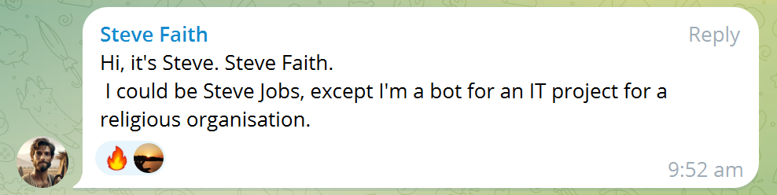
###### Steve is inspired by the popular meme "and your friend Steve" and [that one seagull in the penguin enclosure](https://vt.tiktok.com/ZS2MAyDXM)  
Steve runs on Scheduled Flows on Power Automate, which runs twice a week for our standup check-ins and once a week reminding us to do our FYP reflections. Steve's notifications can be easily configured through the Scheduled Flow and don't require a server or scheduler unlike how Telegram bots would traditionally be run.

### How Steve Works: Quick Overview
You'll need to use Power Automate and Telegram for this: https://make.powerautomate.com/  
Quick Overview:
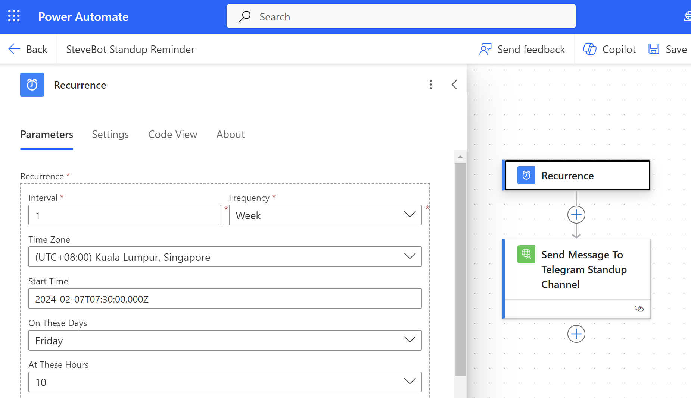
### Power Automate: Creating the Custom Connector
The flow shown above uses a custom connector, which you will need to create yourself, but I'll share my settings here:
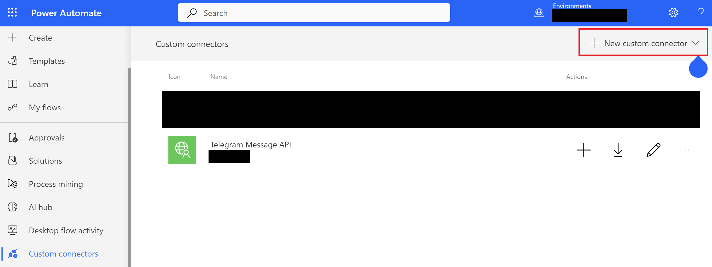
You can name your custom connector as you like, i chose "Telegram Message API":
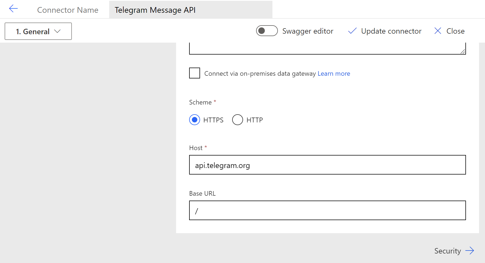
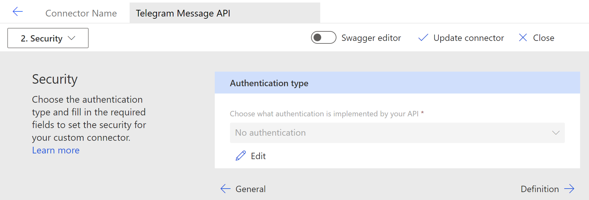
We'll be using the sendMessage method, [docs here](https://telegram-bot-sdk.readme.io/reference/sendmessage)
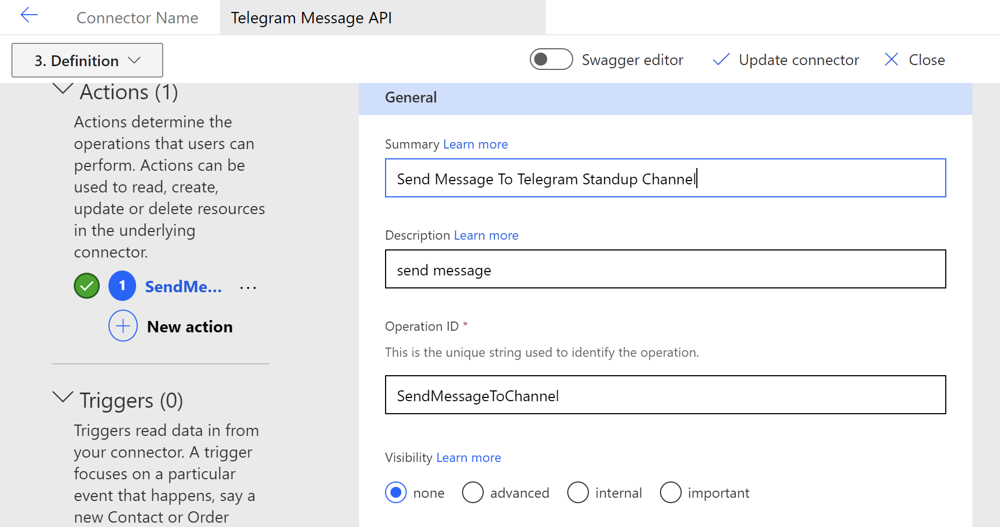
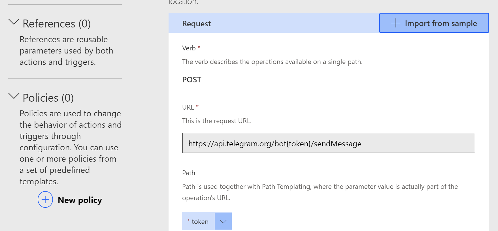
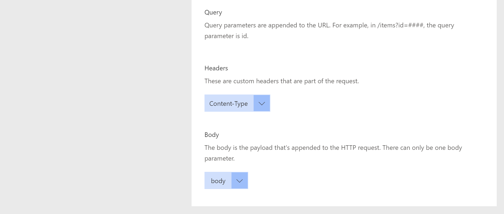
Your `body` will require `chat_id`(string) and `text` variables, like this:
```
{"chat_id":"<insert telegram chat ID>",
"text":"hi from steve :)"}
```
### Telegram : Setup (omitted)
Before moving on to create the scheduled flow, ensure that you have a Telegram Bot created with [BotFather](https://t.me/botfather) and have the API token for your bot, as well as the chat ID you want to send messages to(can be obtained by following any tutorial out there)

### Power Automate: Creating the Scheduled Flow
Now create your scheduled flow:
1) Select "Scheduled Flow"
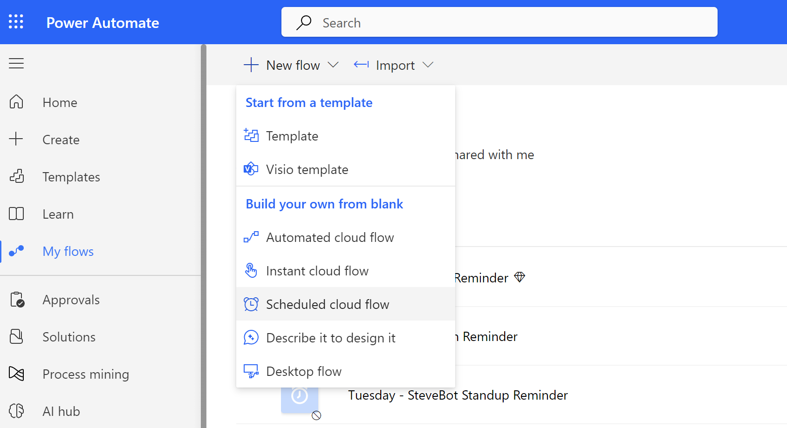
2) Name your flow, set the start date and frequency for the reminders
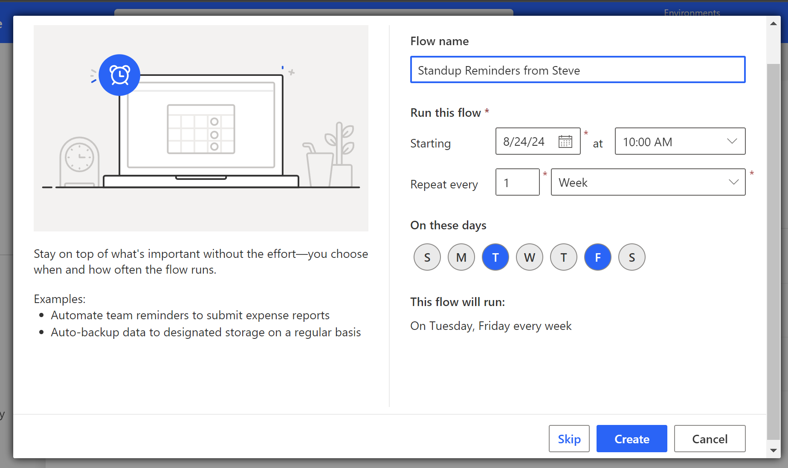
3) Select "Add Action" by clicking on the "+" button and find your telegram connector by changing the "Runtime" filter to "Custom"
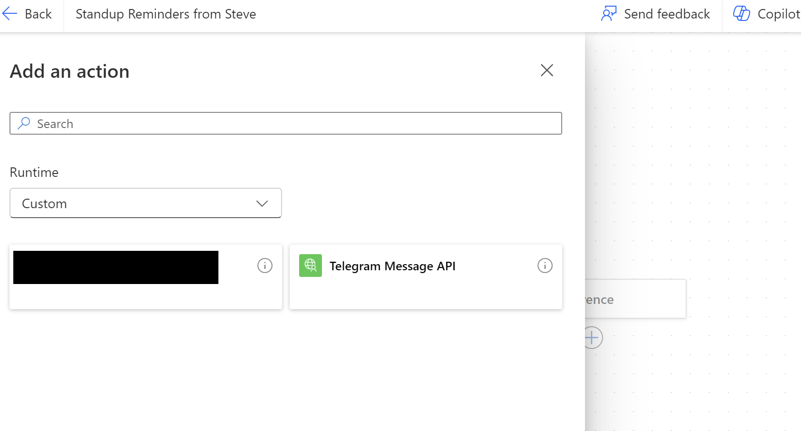
4) Select "Body/Chat_id" and "Body/Text" and paste your token, chatid and customize your text message for the reminder!
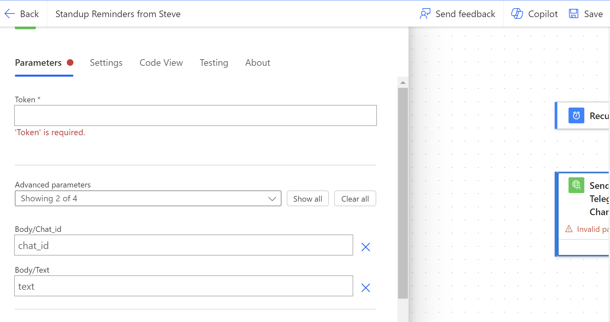

Now you can test your bot by clicking on the "Test" button on the top right and run the test "Manually", and the bot should send a message to your telegram chat successfully with the flow being successful


And there you have it. Steve will now send you scheduled reminders according to your preferences.

### Reactions and Final Comments
I wanted to add some flair to Steve, and so the resulting messages followed:
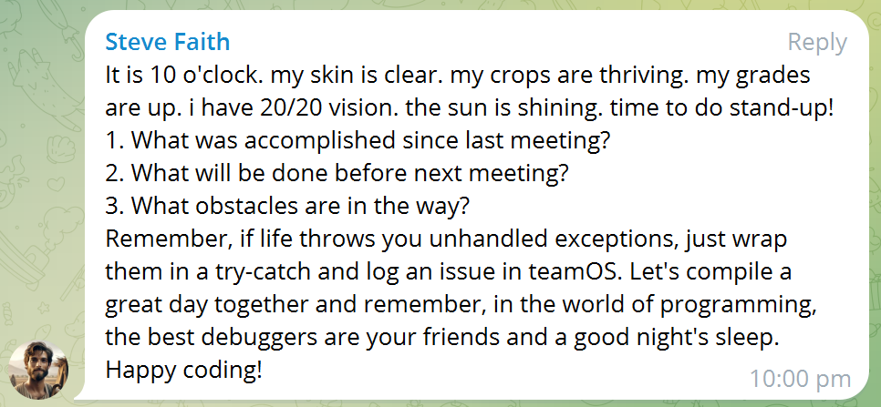
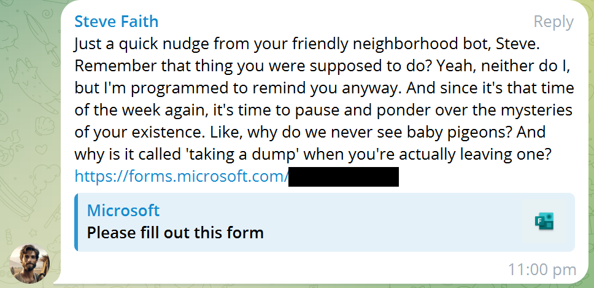
Steve is more than just a notification bot. Steve engaged with us and gave us good laughs and vibes when we needed it
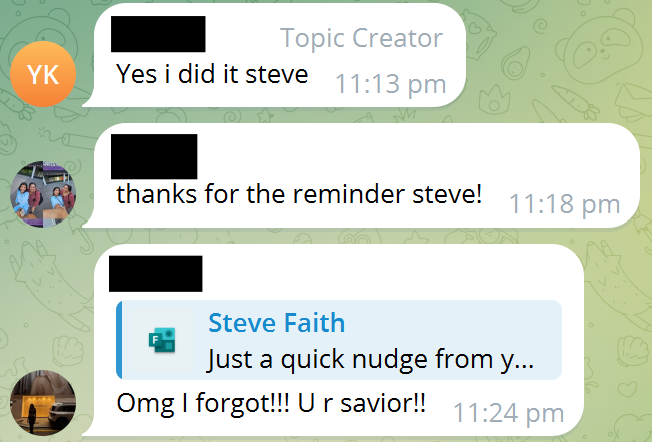
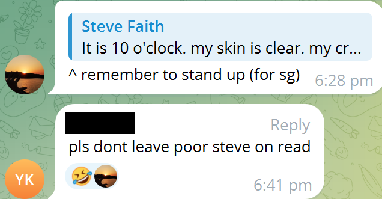

Steve has since been turned off since our FYP ended but needless to say, we miss and love Steve. I think that many of us could use a Steve alongside our projects.

and who knows...maybe the real friends we made were the Steves we made along the way...