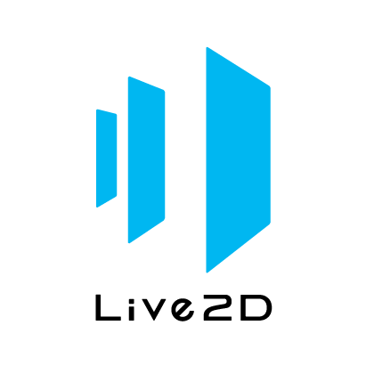



## Project Management, Software/Web Development




• Classification + RAG Bot Project utilising Langchain, Ollama, Deepseek, Llama and Hugging Face models





 

 
  

• Collaborated with team of 6 to create a volunteer management system for Serving in Mission (SIM Singapore), which allows project coordinators to manage volunteers and coordinate projects. Consists of a frontend web/user module built with Python Flask and React JS with Vite, and backend and notification modules supported by Power Automate flows and Microsoft ecosystem(apps such as Outlook, To-Do etc.)
 
• Project was managed with Jira with Agile practices and documented with Confluence, and completed over the course of 7x2 week sprints.
 
• Responsible for solution architecture from proposal, tech stacks, to design and development of modules, and integration with Microsoft ecosystem.  
 
• Primary developer for frontend modules in ReactJS  
 
• Web security implementation and configuration through Microsoft SSO (Azure Entra ID) including issuing of access tokens and Python Flask middleware for token verification and APIs  
 
• Designed and built complex system scheduler functions, automated notifications in Power Automate





  

•	Collaborated with team of 6 to develop first release of a learning journey planning system with Python Flask framework using Agile and DevOps practices with Jira and CI/CD on GitHub.
 
•	Development of APIs, automated unit testing configurations and code with Pytest.
 
 






  

  

• Collaborated with team of 6 to develop a subscription app comprised of microservices using Python, Flask, Javascript, SQL and Docker for deployment, that allows content creators to create content locked behind a paywall, and subscribers to engage with the content.
 
• Devised and developed notification module using Telegram API.  
 
 




## Frontend Development, UI/UX



     

• Collaborated with team of 6 to create a corporate pass loaning system with Springboot, Java, NextJS, ReactJS and MUI for Singapore Sports School as part of their employee welfare, which allows employees to make card bookings for attraction visits, admins to manage users, track card collection and return, and sends automated notifications.
 
• Devised and developed page skeleton code, common components in ReactJS, API integration with React Query and implementing security with route guarding and user access control with JWT Tokens in middleware.





 

• Create prototype of voice assistant mobile app, SMU.AI, aimed to help improve students’ quality of life by improving accessibility.
 
• Principal solution concept designer, utilising Live2D to create animations synced and puppeted by audio
 
• Designed UI with Figma, of over 40 screens with animations, and created video to showcase app.
 

<iframe width="560" height="315" src="https://www.youtube.com/embed/-7wbLxnPB_U?si=hq2e9ZFsRzlEUi_h" title="YouTube video player" frameborder="0" allow="accelerometer; autoplay; clipboard-write; encrypted-media; gyroscope; picture-in-picture; web-share" referrerpolicy="strict-origin-when-cross-origin" allowfullscreen></iframe> 




 

• Learnt various design principles and how to conduct UX research
 
• Designed low and high fidelity UI prototypes in Figma, user flows, user personas and conducted UX A/B testing with a team of 6 for GoNeutral, a mobile application that shows carbon footprint for various transport modes for travel routes to enable more eco-friendly awareness for users
 
<iframe style="border: 1px solid rgba(0, 0, 0, 0.1);" width="800" height="450" src="https://embed.figma.com/design/fw8ihlCCb643mZO94JuErC/GoNeutral-(Copy)?node-id=0-1&embed-host=share" allowfullscreen></iframe>



